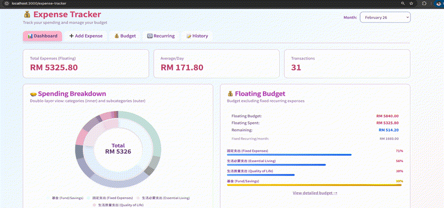

# Life Dashboard — Expense Tracker

A personal expense tracker I built to replace spreadsheets. Tracks spending against monthly budgets, handles recurring transactions, and gives a quick visual overview of where money goes.

**Stack:** Next.js 14 (TypeScript) · FastAPI (Python) · SQLite



> Screenshots use simulated data.

## Features

- **Dashboard** — Donut chart breakdown by category, floating budget panel with remaining balance
- **Budget tracker** — Progress bars per category with over-budget alerts
- **Add expense** — Built-in calculator, category/subcategory selection
- **Recurring transactions** — Set it once (e.g. house loan, phone bill), auto-apply monthly
- **Transaction history** — Filterable table with edit/delete

## Quick Start

### Backend

```bash
cd backend
python -m venv .venv && source .venv/bin/activate
pip install -r requirements.txt
python api.py
```

Runs on `http://localhost:8000` · API docs at `http://localhost:8000/docs`

### Frontend

```bash
cd frontend
npm install
npm run dev
```

Runs on `http://localhost:3000`

## Project Structure

```
.
├── backend/
│   ├── api.py                  # FastAPI routes
│   ├── config.py               # Categories and budget defaults
│   ├── database/sqlite_impl.py # DB layer
│   └── services/               # Expense, budget, recurring logic
├── frontend/
│   ├── app/
│   │   ├── page.tsx            # Landing page (modular dashboard)
│   │   └── expense-tracker/    # Expense tracker pages
│   ├── components/ui/          # shadcn/ui components
│   └── lib/api.ts              # API client
└── img/                        # Screenshots
```

## Modules

- **Expense Tracker** — Active
- Habit Tracker, Savings & Investment, Journal — Planned

## Notes

Categories and budget amounts are configured in `backend/config.py`. The database is a local SQLite file — no cloud sync, no accounts, just runs locally.
